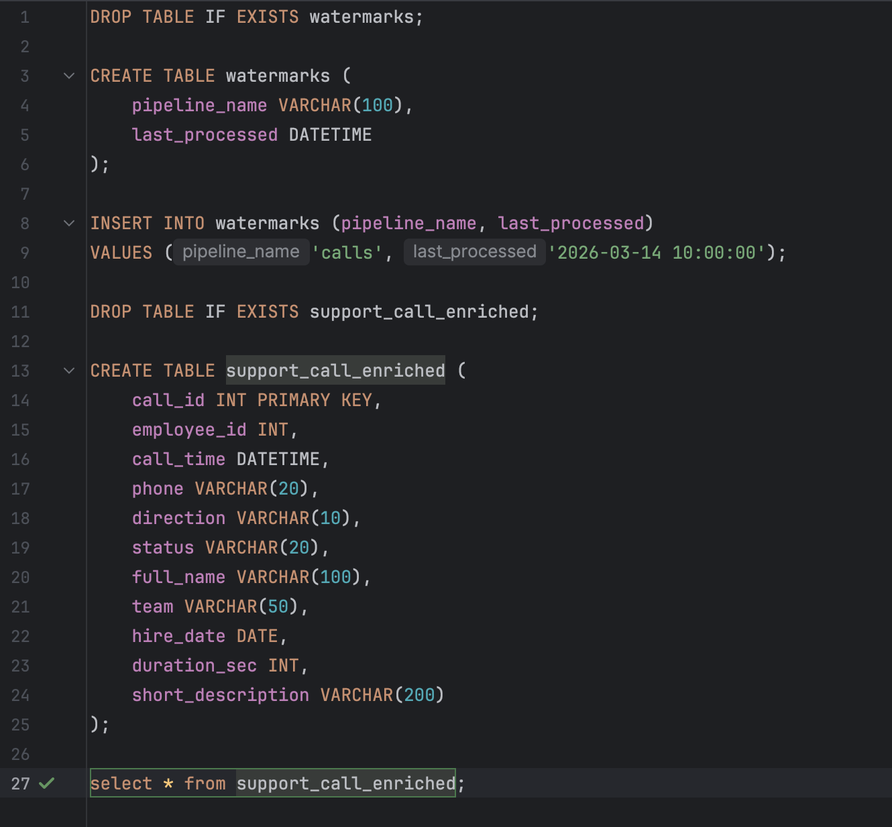
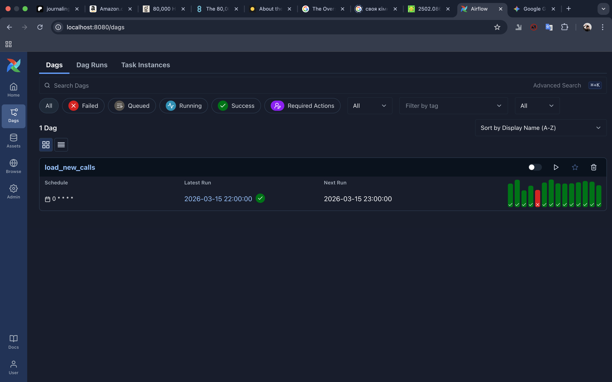
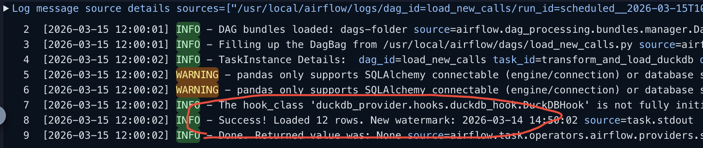
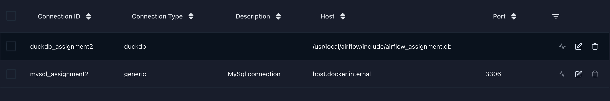
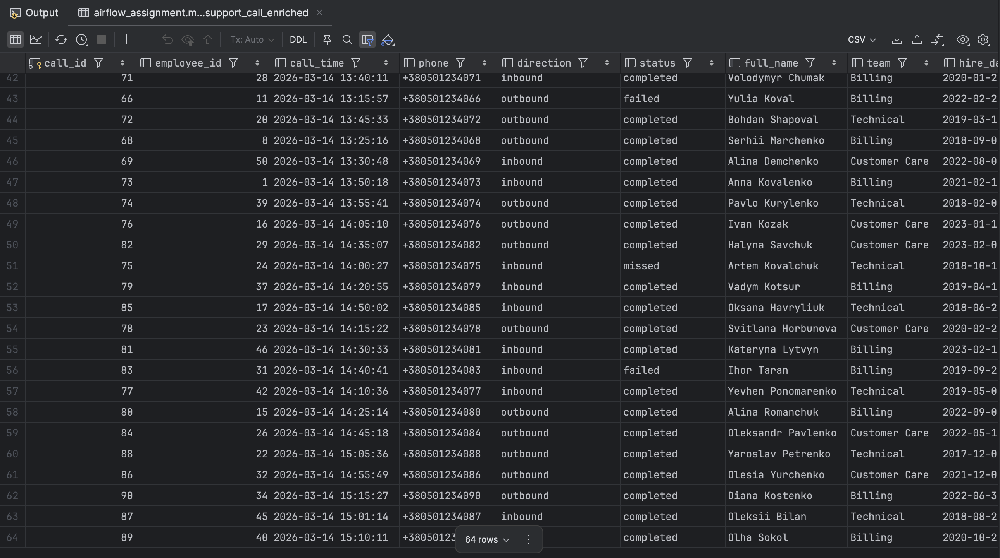

# 🚀 Airflow Support Call Enrichment Pipeline

## Project Overview
This pipeline automates the extraction, enrichment, and loading of support call data. It follows an **incremental load** strategy using a **watermark** system to process only new records every hour. 

## 🛠 Tech Stack
* **Orchestration:** Apache Airflow
* **Source DB:** MySQL (Employees & Calls)
* **Mock API:** JSON files (Telephony metadata)
* **Storage:** DuckDB (Analytical storage)
* **Language:** Python (Pandas)

---

## ☎️ Data
- JSON telephony files can be found in `include` folder
- DuckDB database is attached in `include` folder as well; here are my queries:

- MySQL queries for table creation are also added to the repo: `airflow_mysql_table creation.sql`
  
---

## 🏗 DAG Structure
1. **`detect_new_calls`**: Queries MySQL for calls where `call_time > last_processed_watermark`. Since i only simulated new calls and they were actually all in my table, i had to set an upper limit for calls as well: `call_time < watermark + 1`. IDs are pushed using XComs.
2. **`load_telephony_details`**: Dynamically reads JSON files for the detected call IDs.
3. **`transform_and_load_duckdb`**: Joins MySQL data (`calls`, `employees` tables) with JSON metadata using pandas and performs an UPSERT into DuckDB. Then I update the watermark (which is stored in DuckDB).

---

## 💡 Dag in Airflow UI
### Here i am showing how my DAG runs look in Airflow :)

### Example of logs after a DAG run:

### My connections to MySQL and DuckDB:

---

## Final table in DuckDB

